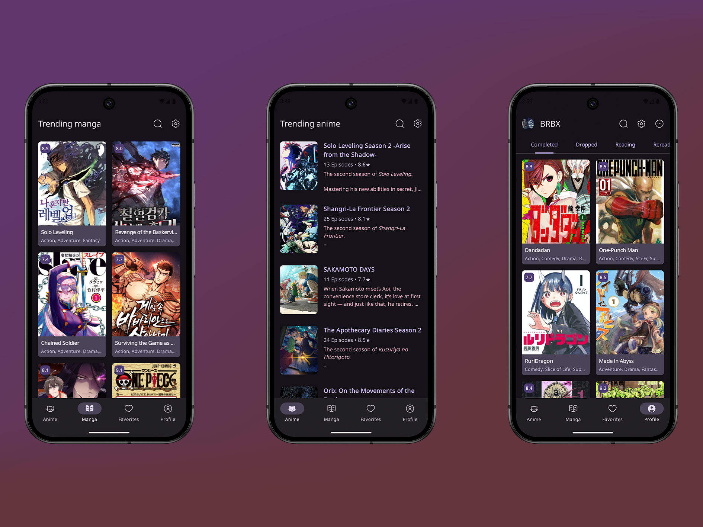

# AniKun

### An unofficial android client for [AniList](https://anilist.co/home)

## Features
- Detailed Anime & Manga Information - Get detailed information about each manga or anime.
- Trending Anime and Manga - See what's trending right now
- Favorites - Keep track of your favorite anime & manga by adding them to your favorites list.
- Your Anime and Manga lists - Track anime & manga by adding them to lists.
- Custom color schemes - 6 custom color schemes
- Authentication - Authenticate with your [AniList](https://anilist.co/home) account
## Libraries
- [ViewModel](https://developer.android.com/topic/libraries/architecture/viewmodel)
- [Navigation](https://developer.android.com/guide/navigation)
- [Hilt](https://developer.android.com/training/dependency-injection/hilt-android)
- [Retrofit](https://square.github.io/retrofit/)
- [Jetpack Compose](https://developer.android.com/compose)
- [Coil](https://coil-kt.github.io/coil/compose/)
- [Room](https://developer.android.com/reference/androidx/room/package-summary)
- [Lottie](https://github.com/airbnb/lottie/blob/master/android-compose.md)
- [Paging](https://developer.android.com/jetpack/androidx/releases/paging)
- [Haze](https://chrisbanes.github.io/haze/latest/)
### App preview
https://github.com/user-attachments/assets/a53e1373-f4ad-4b2d-9b93-0770ee43ce4a